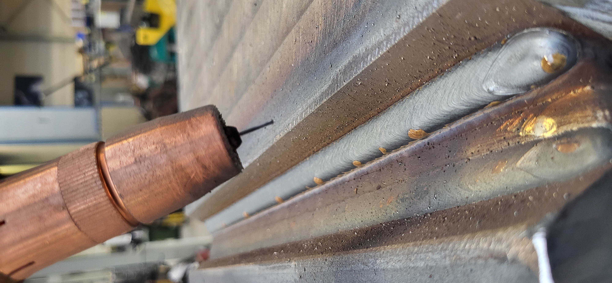
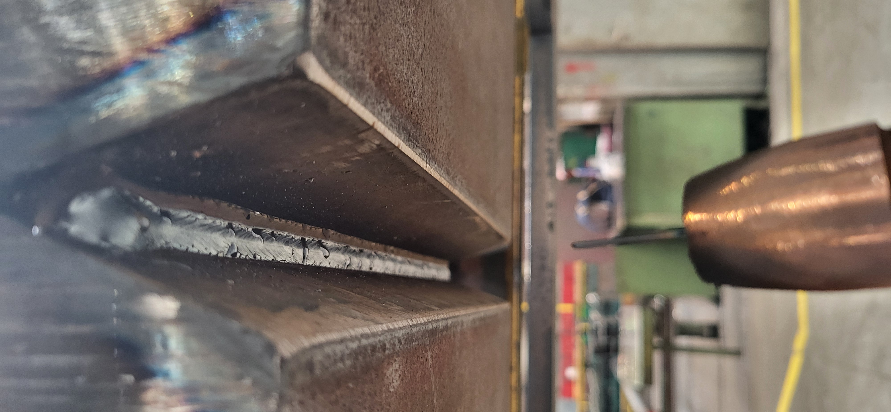
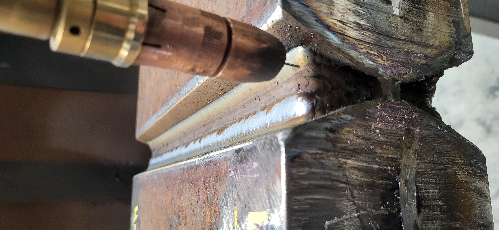
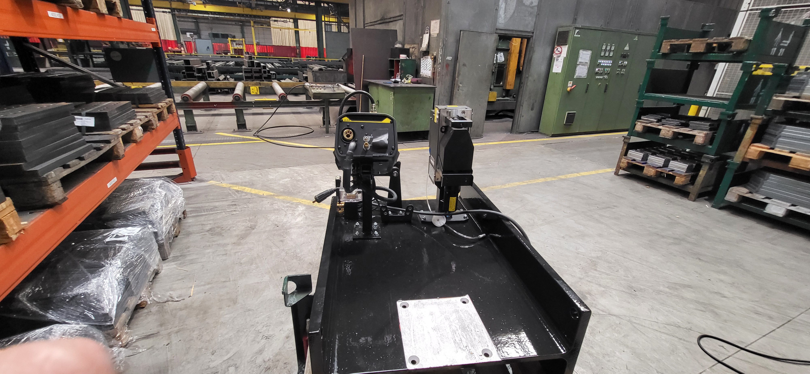

***Project:   Automated Multi-Layer X-Seam Welding Cell*** 
1. Project Description
   
  - This project documents a self-contained, vertically integrated automation solution where all mechanical design, fabrication, and robot programming were completed internally.

  - The core task involves automating a multi-layer welding process for a specific joint geometry using a Yaskawa robot. The program is designed to perform a multi-layer weld on an X-seam configuration for a 120mm thick plate (60mm bevel with a 40° angle per side). The      process alternates between PA (flat) and PE (overhead) positions to fill the groove, using a 1.2mm ESAB OK AristoRod 12.50 wire for both positions.

   - The program's architecture is modular, utilizing several .JBI files to manage different aspects of the process, including user frame definition, master control sequencing, and discrete welding operations.

2. Core Goals
  - Automate Welding Process: Fully automate the multi-layer welding of the specified 120mm X-seam.

  - Ensure Weld Accuracy: Achieve precise weld deposition by defining an accurate user frame and teaching exact start/end points.

  - Complete Joint Fill: Guarantee a complete and structurally sound weld covering both the top (BOVEN) and bottom (ONDER) sections of the seam.

  - Optimize Robot Path: Manage robot movements and transitions between welding areas safely and efficiently.

  - Modular Programming: Create a modular and maintainable program structure using separate .JBI files for distinct tasks.

3. Key Requirements & Program Structure
-The solution is built upon a series of specialized Yaskawa Inform (JBI) jobs:

- User Frame Definition:

TESTUF-ARNE.JBI: Accurately defines the coordinate system relative to the workpiece.

- Master Control:

MASTER-START-ML.JBI: The main job that orchestrates the overall sequence of operations and calls sub-programs.

 - Sectional Welding Jobs:

MULTILAYER-TESTAFLOOP-BOVEN.JBI: Manages the welding logic for the top part of the X-seam.

MULTILAYER-TESTAFLOOP-ONDER.JBI: Manages the welding logic for the bottom part of the X-seam.

 - Path Point Management:

Includes functionality within the welding jobs to determine and save the start and end points for each weld pass.

 - Transition Jobs:

VAN-BOVEN-NAAR-ONDER.JBI: Manages the robot's movement from the upper to the lower welding zone.

VAN-ONDER-NAAR-BOVEN.JBI: Manages the robot's movement from the lower to the upper welding zone.

 - Multi-Layer Capability:

Implements logic to handle multiple weld layers, utilizing macros for path shifting (SHIFT-R1.JBI) and weaving (WEAVING.JBI).

  
     
